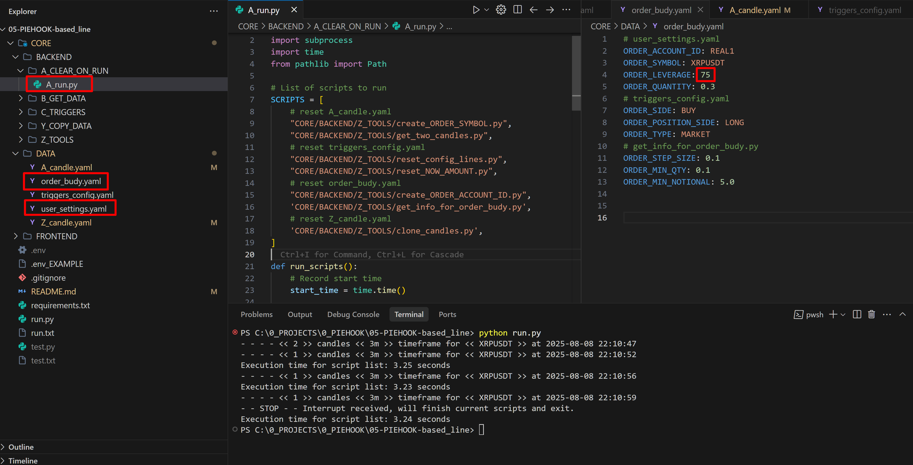

# Autotrade-Based-Line

## Обзор проекта

autotrade-based-line — это система мониторинга данных по криптовалютам, которая получает данные свечей с Binance и обрабатывает их с помощью серии Python-скриптов. Система работает в непрерывном цикле, выполняя каждый скрипт по очереди согласно настройкам в конфигурационном файле.

## Текущая стадия разработки



## Конфигурация

Отредактируйте файл `CORE/DATA/user_settings.yaml` для настройки системы:

## Разработка

<details>
  <summary>Журнал DEV</summary>

## v0.0.1

- ДАТА СОЗДАНИЯ ПРОЕКТА: 2025.06.29
- создан run.py, который выполняет чек-лист
- создан user_settings.yaml со всеми необходимыми настройками
- создан fetch candles.py для получения свечей с binance
- создан clone candles.py для клонирования файла свечей

## v0.0.2

- создан скрипт сравнения цен

## v0.0.3

- Добавлена логика анализа тренда на основе YAML-файла AB_check_trend.py
- Автоматическое выполнение логики по тренду: AC_use_trend.py, ACA_check_green.py, ACB_check_red.py и подскрипты
- Логика сравнения и записи процентного изменения
- Улучшена обработка ошибок и корректное завершение работы

## v0.0.4

- Введён единый цикл запуска всех скриптов через основной run.py
- Добавлено автоматическое измерение времени выполнения цикла
- Реализована очистка памяти после каждого цикла (gc.collect)
- Добавлена обработка сигнала SIGINT для корректного завершения работы
- Вынесены настройки в отдельный YAML-файл и реализована централизованная загрузка настроек
- Введены отдельные скрипты для зелёного/красного тренда и их автоматический запуск в зависимости от значения TREND
- Добавлены сообщения об ошибках при работе с файлами и внешними сервисами
- Улучшена структура backend: разделение на A_GET_DATA, B_CHECK_TREND, Z_CLONE_CANDLE
- Добавлены тестовые скрипты для отладки (test1.py, test2.py и др.)

## v0.0.5

- добавлнно A_CLEAR_ON_RUN для обнуления данных
- осущестовлен CHECK_CANDLE_END
- добавленна переменная NEXT_LONG_PERCENT в config
- добавлен скрипт reset_NEXT_STEP_AMOUNT
- начал добовлять 1д свечи

## v0.0.6

- перепроверен модуль A_CLEAR_ON_RUN
- перепроверен модуль B_CREATE_DATA
- перепроверен модуль C_CHECK_CANDLE_END
- исправленно получение первых свечей
- перепроверен модуль D_CHECK_SELL_PERCENT
- создание D_CHECK_SELL_PERCENT
- создание .env
- переименование .env2 в .env
- перепроверен модуль D_CHECK_SELL_PERCENT
- создание Y_MESSAGES
- добавленно время выполнения скрипта

## v0.0.7

- исправлено выполнение реальных ордеров
- добавлен .env_EXAMPLE
- added folders BACKEND DATA FRONTEND
- протестиравана вся логика проекта, полностью работает
- добавлен список TRIGGERS в triggers_config.yaml
- созданы файлы CHECK TRIGGERS_CANDLE_GREEN_END и ORDER_TYPE_OF_LONG_END
- начинаем создовать первичное состояние файла order_budy.yaml
- все работает, следующий этап get ORDER_LEVERAGE 75
- добавлен screenshot.png
- теперь меняет на ISOLATED и активирует MAX_LEVERAGE
- создана папка C_THE_FLOWS и workflows_config.yaml

## v0.0.8

- C_CHECK_CANDLE_END D_CHECK_PERCENT_SELL E_CHECK_OPEN_LINE_CROSS
- перепроверен модуль CHECK_HIGH_LOW_CROSS

## v0.0.9

- создан рабочий Z_WEBSOCKET.py

## v0.1.0

- v0.1.0 создана стабильного версия websocket ✔️ и Y_database.csv

## v0.1.1

- ускорены скрипты выполнения 
- проделана стабилизация старта и PRE_CONFIG
- перепроверена базавая FLOW_1 для получение текущей свечи
- исправлен файл GET_WEBSOCKET_STREAM
- перепроверен базовый FLOW_1

## FUTURE PLANS

- creating settings for pre config on off

</details>

<details>
  <summary>Github ШПАРГАЛКА</summary>

## Загрузить последние обновления и заменить локальные файлы

```
git fetch origin; git reset --hard origin/master; git clean -fd
```

## Посмотреть последние 10 коммитов и выбрать hash

```
git log --oneline -n 10
```

## Использовать hash для получения нужной версии локально

```
git fetch origin; git checkout master; git reset --hard 1eaef8b; git clean -fdx
```

## Обновить репозиторий

```
git add .
git commit -m "перепроверен базовый FLOW_1"
git push

```

## Полезные эмодзи для документации и кода

✅ ☑️ ✔️ ✳️ ❌ ❎ ✖️ 🔁 🔂 🔄
🚀 ⚙️ 💻 🔥 🧪 🐞 📝 🛠️ 🔄 🕒
📈 📉 🗂️ 📦 🎯 📚 🧰 🏁 🔔 💡
🛑 🔍 🏗️ 🧩 🧭 🛡️ 🍀 🌐 📢 🧯
🛫 🎉 🧿 🖥️ 💾 🧬 🧑‍💻 🧑‍🔬 📊 📋
📌 📎 🖱️ 🖨️ 🗃️ 📂 🗒️ 🛒 🧹 🖊️
🗑️ 🕹️ 🧲 🧱 🏷️ 🏆 🥇 📜 📅 🗓️ 🔗
🔒 🔓 🗝️ 🧊 🧞 🧺 🧳 📡 🏢 🏭
🏠 🏘️ 🏚️ 🌟 🎨 🧡 💙 💚 💛 💜
🩵 🩷 🔋 🧨 🧤 🧦 🧥 🧢 🧴 🧵
🧶 🛎️ 🛏️ 🛋️ 🚪 🚧 🚦 🚥 🚨 🚒
🚑 🚓 🗄️ 🗳️ 📫 📪 📬 📭 📮 📨
📩 📤 📥 📧 🔬 🔭 🕵️‍♂️ 🕵️‍♀️ 🧑‍🏫
🧑‍🔧 🧑‍🔩 🧑‍🎨 🧑‍🚀 🧑‍✈️ 🧑‍🚒 🧑‍⚕️ 🧑‍🎤 🔨 🔧
🔩 🗜️ 🖲️ 💾 💿 📀 📼 🧫 ⚡ 🌀
🌪️ 🛸 🎲 🎮 🐛 🐜 🦠 ⏫ ⏬ ⏩
⏪ ⏭️ ⏮️ 🆗 🆕 🆙
🪙 🪙 💰 💴 💵 💶 💷 💸 💳 🏦

</details>
